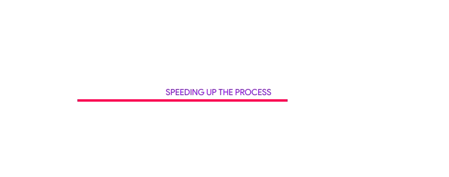

## react-loading-text



A simple module to display all types of weird sentences while your application loads.

## Installation

```sh
$ npm i react-loading-text
```

## Usage

```js
import React from 'react';
import LoadingText from 'react-loading-text';

class LoadingView extends React.Component {
	render() {
		return (
			<LoadingText />
		)
	}
}
```

You can also specify additional statements and the interval time.

```js
<LoadingText extras={["Another Loading Text", "One more!"]} interval={4000} />
```
